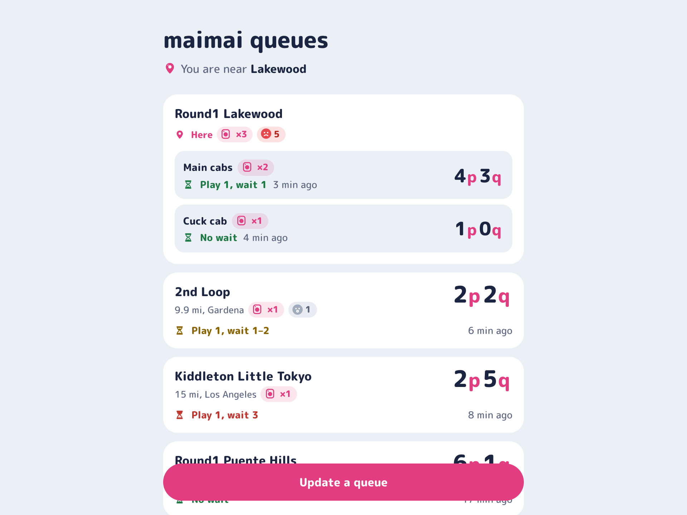
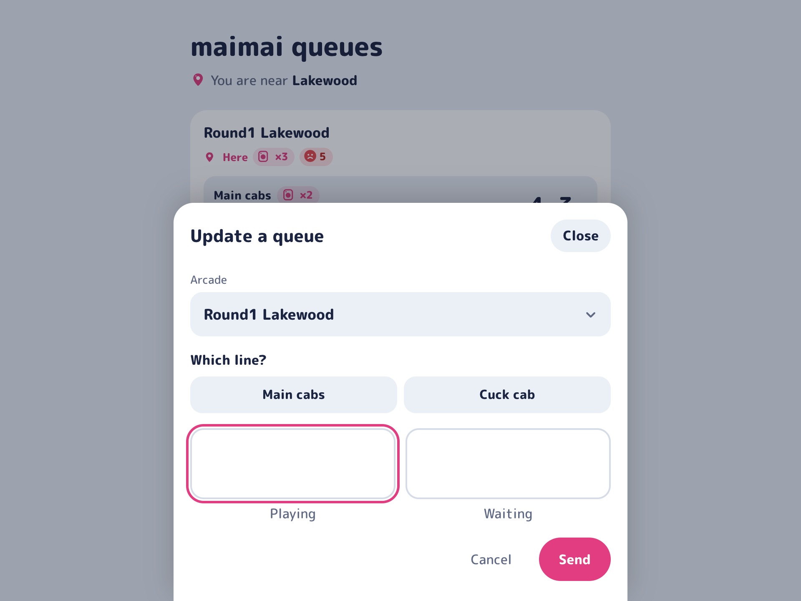
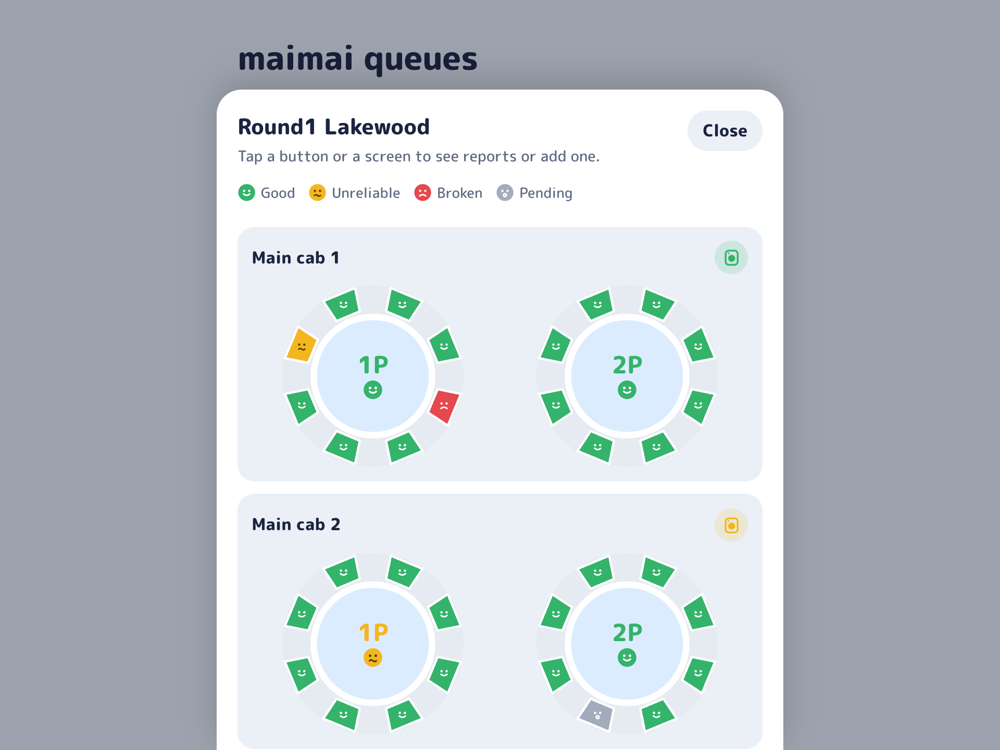
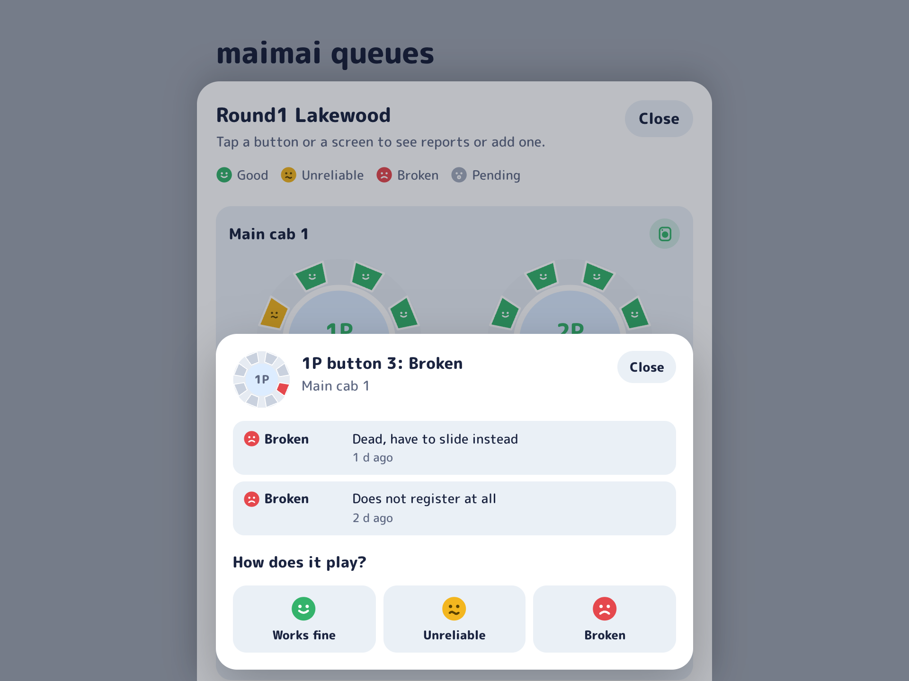
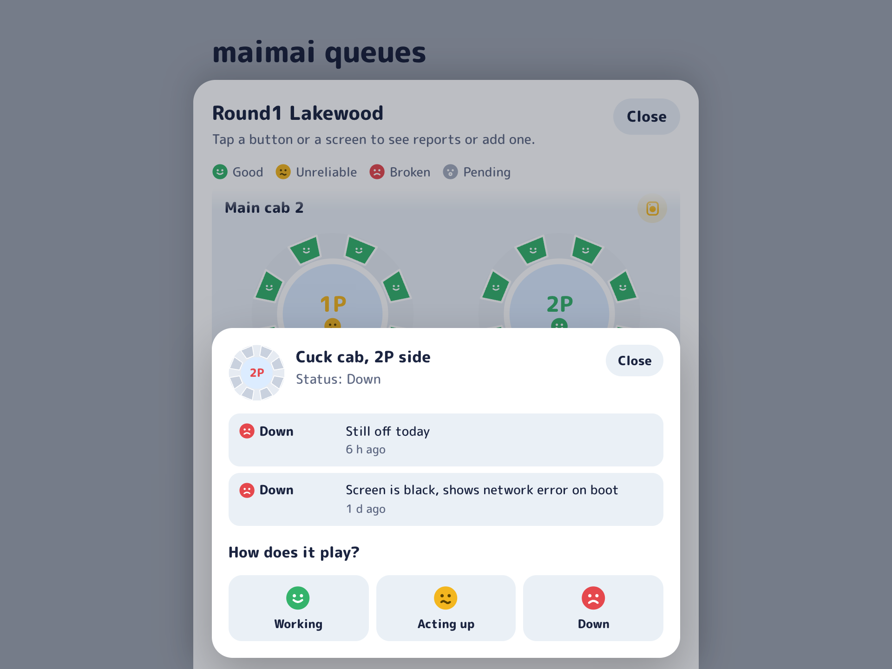

<div align="center">

<picture><source media="(prefers-color-scheme: dark)" srcset=".github/assets/preview-1-dark.png" /></picture>

[![CI][CI Badge]][CI]
[![Bun][Bun Badge]][Bun]
[![Svelte][Svelte Badge]][Svelte]
[![Discord][Discord Badge]][Carbon]
[![License][License Badge]](LICENSE)

</div>

maiq tracks live [maimai DX](https://maimai.sega.com/) queues at arcades across Southern California. Players report how many people are playing and waiting in shorthand (`4p2q` means &ldquo;4 playing, 2 queuing&rdquo;), and everyone else sees the current count, how old it is, and how long they would wait if they left now.

There are two places where you can report a queue:

- The website sorts arcades by distance and detects if you are standing inside an arcade. Reports from inside an arcade are &ldquo;verified&rdquo; and outrank reports more distant.
- The Discord bot pins a live status message in each arcade's channel and reads counts from chat. The bot will react with ✅ if it properly parses and updates a report.

maiq also tracks cabinet hardware. Anyone can report a button or cabinet as unreliable/broken, or a whole side as down.

---

| <picture><source media="(prefers-color-scheme: dark)" srcset=".github/assets/preview-2-dark.png" /></picture> | <picture><source media="(prefers-color-scheme: dark)" srcset=".github/assets/preview-3-dark.png" /></picture> |
| ----------------------------------------------------------------------------------------------------------------------------------------------------------------------------- | ----------------------------------------------------------------------------------------------------------------------------------------------------------------------------- |
| <picture><source media="(prefers-color-scheme: dark)" srcset=".github/assets/preview-4-dark.png" /></picture> | <picture><source media="(prefers-color-scheme: dark)" srcset=".github/assets/preview-5-dark.png" /></picture> |

---

### Development

maiq requires [Bun v1.3+](https://bun.sh/) and Docker.

1. Install dependencies and the Git hooks:

   ```sh
   bun i
   prek install
   ```

2. Start the development database:

   ```sh
   docker compose -f compose.dev.yml up -d --wait
   ```

3. Start the API and the web app:

   ```sh
   bun dev
   ```

   The web app runs at http://localhost:5180 and proxies `/api` to the API on port 3000. `maiq.d/00-defaults.yaml` uses Cloudflare's dummy Turnstile keys for local development purposes.

Before committing, run `bun run lint`, `bun run format:check`, `bun run typecheck`, and `bun run test`. If you change `packages/db/src/schema.ts`, run `bun run db:generate` and commit the new migration.

### Deployment

maiq ships as one Docker image that serves the web app, the API, and the Discord bot behind nginx.

1. Copy `.env.example` to `.env` and fill it in. The image refuses to start without `MAIQ_PUBLIC_URL` or with Cloudflare's Turnstile test keys, so create a real [Turnstile](https://developers.cloudflare.com/turnstile/) widget first.
2. Start the stack:

   ```sh
   docker compose up --build -d
   ```

   The app listens on `127.0.0.1:8080`. Put a TLS proxy such as Caddy in front of it.

### Discord bot

1. Create an application in the [Discord developer portal](https://discord.com/developers/applications) and copy its application ID, public key, and bot token into `.env`.
2. Under **Bot**, enable the **Message Content** intent. The bot needs it to read counts from chat.
3. Set the interactions endpoint URL to `https://<your domain>/discord/interactions`.
4. Register the slash commands:

   ```sh
   bun run bot:deploy
   ```

5. Invite the bot with the `bot` and `applications.commands` scopes and the View Channel, Send Messages, Pin Messages, Add Reactions, and Read Message History permissions.
6. In each arcade's channel, run `/setup arcade:<arcade>` to post and pin its live status.

[CI]: https://github.com/socal-maimai/maiq/actions/workflows/ci.yml
[CI Badge]: https://img.shields.io/github/actions/workflow/status/socal-maimai/maiq/ci.yml?branch=main&label=ci&logo=github&color=8c2451&style=flat-square
[Bun]: https://bun.sh/
[Bun Badge]: https://img.shields.io/badge/bun-1.3-b82e69?logo=bun&logoColor=fff&style=flat-square
[Svelte]: https://svelte.dev/
[Svelte Badge]: https://img.shields.io/badge/svelte-5-e23d80?logo=svelte&logoColor=fff&style=flat-square
[Carbon]: https://carbon.buape.com/
[Discord Badge]: https://img.shields.io/badge/discord-carbon-ff5b9b?logo=discord&logoColor=fff&style=flat-square
[License Badge]: https://img.shields.io/badge/license-MIT-ffa3c4?style=flat-square
